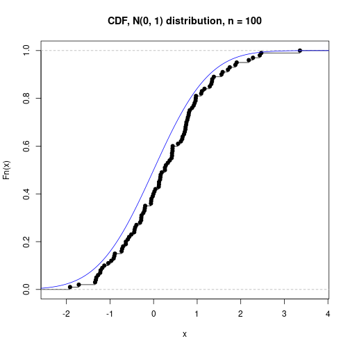
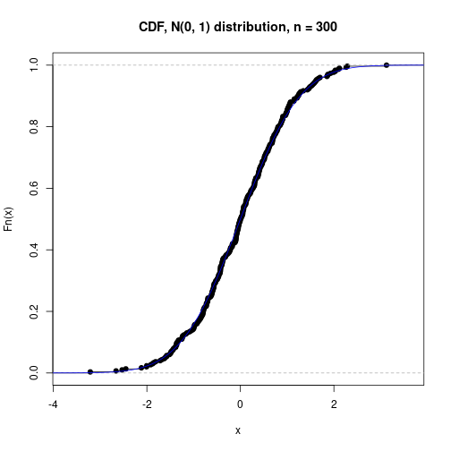
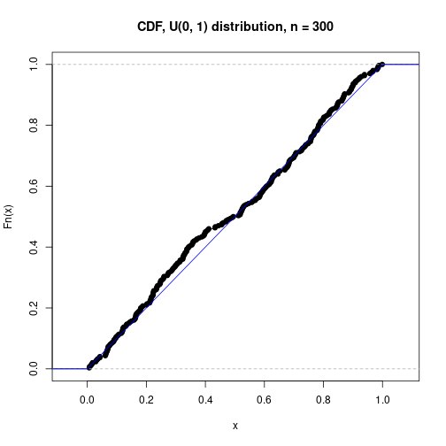

# Моделирование теоремы Гливенко-Кантелли

Создадим функцию, которая будет рисовать на графике эмпирическую функцию распределения и реальную функцию распределения для распределения `dist_name` с функцией распределения `dist_F` и генератором `n` случайных значений по этому распределению `dist_G`.


```r
cdf_plot <- function(dist_name, dist_F, dist_G, n) {
  x_n   <- dist_G(n)
  x_min <- min(x_n)
  x_max <- max(x_n)
  step  <- (x_max - x_min) / 1000
  start <- x_min - 150 * step
  end   <- x_max + 150 * step
  plot(ecdf(x_n), main = paste0("CDF, ", dist_name, " distribution, n = ", n))
  lines(seq(start, end, by=step), dist_F(seq(start, end, by=step)), col="blue")
}
```

Теперь мы готовы посмотреть на графики эмпирических и реальных функций распределения для различный распределений.

## Нормальное распределение


```r
cdf_plot("N(0, 1)", pnorm, rnorm, 10)
```


```r
cdf_plot("N(0, 1)", pnorm, rnorm, 30)
```


```r
cdf_plot("N(0, 1)", pnorm, rnorm, 100)
```




```r
cdf_plot("N(0, 1)", pnorm, rnorm, 300)
```




```r
cdf_plot("N(0, 1)", pnorm, rnorm, 1000)
```


## Равномерное распределение


```r
cdf_plot("U(0, 1)", punif, runif, 10)
```


```r
cdf_plot("U(0, 1)", punif, runif, 30)
```


```r
cdf_plot("U(0, 1)", punif, runif, 100)
```


```r
cdf_plot("U(0, 1)", punif, runif, 300)
```




```r
cdf_plot("U(0, 1)", punif, runif, 1000)
```


